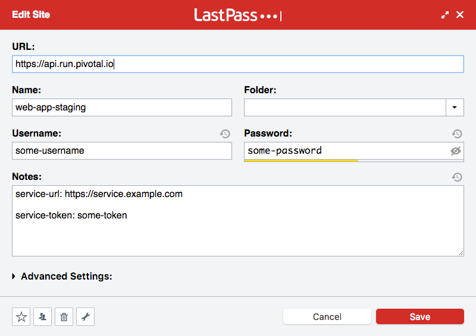
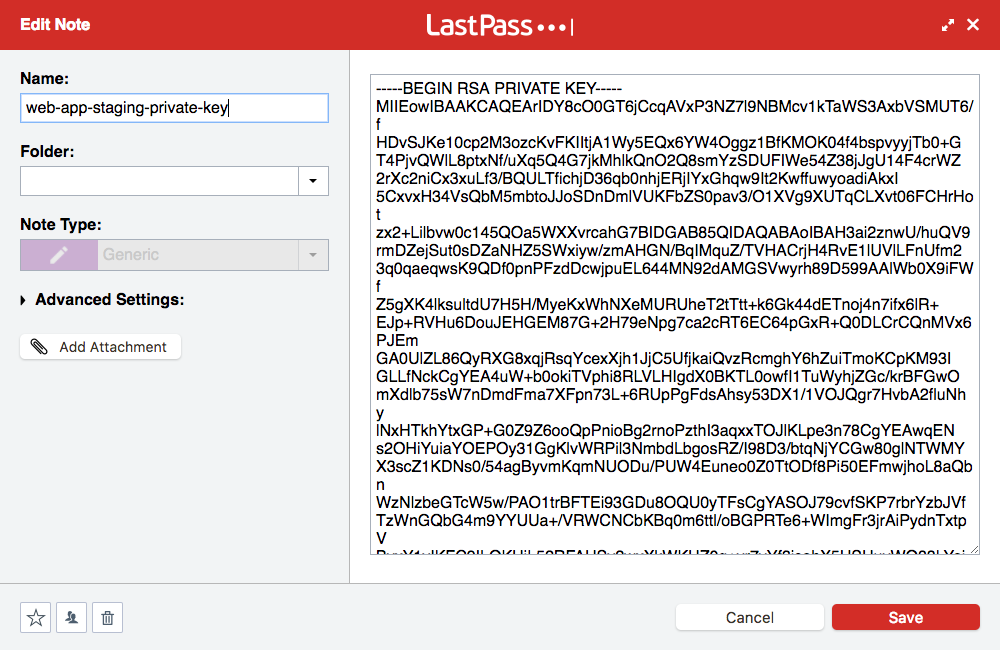

# reconfigure-pipeline

reconfigure-pipeline is a command-line tool that streamlines the process of pulling credentials from [LastPass](http://lastpass.com/) into a [Concourse](https://concourse.ci/) pipeline. It uses the [LastPass CLI](https://github.com/lastpass/lastpass-cli) to read credentials from LastPass, writes these credentials to a [named pipe](https://en.wikipedia.org/wiki/Named_pipe), and calls [fly](https://concourse.ci/fly-cli.html) with the named pipe as an argument, ensuring credentials are never written to disk.

## Motivation

[The Github incident in October 2016](https://github.com/blog/2273-incident-report-inadvertent-private-repository-disclosure) that allowed cloning private repos belonging to other users demonstrated the dangers of keeping credentials in git repositories. For this reason, many teams created tooling, usually in the form of shell scripts, that pulls credentials from LastPass using the LastPass CLI and feeds them into fly or [BOSH](https://bosh.io/).

reconfigure-pipeline was built to avoid duplication of work while ensuring the security of credentials.

## Installation

The latest binary release can be found [here](https://github.com/pivotal-cf/reconfigure-pipeline/releases).

To install from source:

```
go get github.com/pivotal-cf/reconfigure-pipeline
```

## Usage

```
reconfigure-pipeline --target my-target --pipeline my-pipeline --config my-pipeline.yml
```

Where `my-target` is the name of a fly target and `my-pipeline` is the name of the pipeline you wish to reconfigure.

## Syntax

reconfigure-pipeline uses the same syntax as the [new BOSH CLI](https://bosh.io/docs/cli-v2.html) for credential interpolation, with a few LastPass-specific extensions.

Basic syntax in a pipeline looks like:

```yaml
key: ((credential-name/field/inner-key))
```

Where `credential-name` is the name of a credential in LastPass, field is one of Username, Password, Notes, URL, or a custom field, and the inner-key is an optional hash key that denotes the value stored in LastPass should be parsed as a YAML document, most commonly used with the Notes field.

### Sample Pipeline

```yaml
---
resources:
- name: web-app
  type: git
  source:
    uri: git@github.com/pivotal-cf/web-app.git

- name: web-app-staging
  type: cf
  source:
    api: ((web-app-staging/URL))
    username: ((web-app-staging/Username))
    password: ((web-app-staging/Password))
    organization: some-org
    space: some-space

jobs:
- name: job-deploy-app
  plan:
  - get: web-app
  - put: web-app-staging
    params:
      manifest: web-app/manifest.yml
      environment_variables:
        PRIVATE_KEY: ((web-app-staging-private-key/Notes))
        SERVICE_URL: ((web-app-staging/Notes/service-url))
        SERVICE_TOKEN: ((web-app-staging/Notes/service-token))
```

Where the credentials in LastPass look like:




